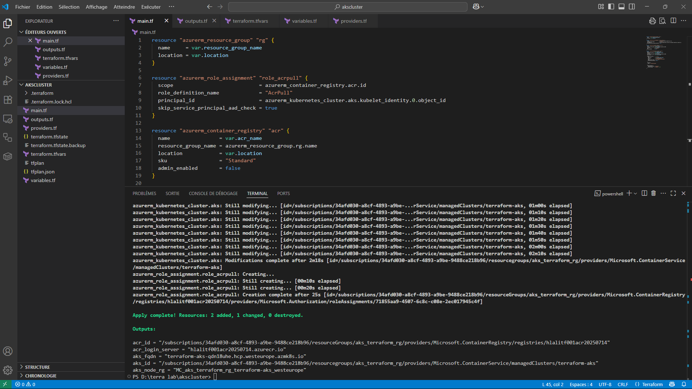
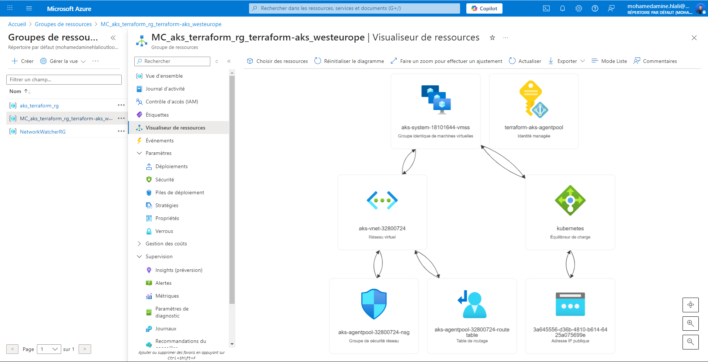
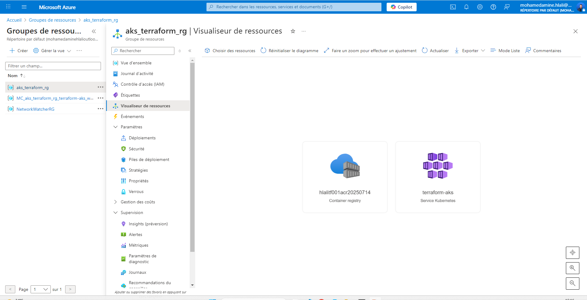

# Azure Kubernetes Cluster using Terraform ☁️🚀

This project provisions a secure, scalable **Azure Kubernetes Service (AKS)**  using **Terraform**.


## 🔧 How to Deploy

```bash
terraform init
terraform plan -out=tfplan
terraform apply tfplan
```

> Make sure your Azure credentials are correctly configured.

<p align="center">
  
</p>


---

## 🗂️ Project Structure

```
akscluster/
├── main.tf
├── variables.tf
├── outputs.tf

├── README.md
├── diagram.png              # Architecture Diagram (see below)
└── .gitignore
```

---

## 📊 Azure Portal Diagram






---

## 🧠 Purpose of This Project

This lab demonstrates a basic real-world infrastructure setup using **Infrastructure as Code (IaC)** with **Terraform** on **Microsoft Azure**.
